# Dokumentacja projektu Shopping List App

Aleksander Baska, Łukasz Bączkiewicz

## 1. Krotki opis projektu

`Shopping List App` to mobilna aplikacja napisana w React Native, przeznaczona do tworzenia i prowadzenia prywatnych list zakupow. Uzytkownik po zalogowaniu moze tworzyc listy, dodawac do nich produkty, oznaczac produkty jako kupione, edytowac dane oraz usuwac niepotrzebne elementy. Dane sa przechowywane w lokalnie hostowanym Supabase, a dostep do nich jest zabezpieczony przez uwierzytelnianie oraz polityki Row Level Security.

Projekt skupia sie na prostocie obslugi, czytelnym interfejsie oraz bezpiecznym przechowywaniu prywatnych danych zakupowych.

## 3. Specyfikacja

### 3.1 Potencjalni odbiorcy systemu

- Osoby robiace codzienne zakupy spozywcze i chcace zastapic papierowa liste zakupow aplikacja mobilna.
- Studenci lub osoby mieszkajace samodzielnie, ktore chca planowac zakupy i kontrolowac, co zostalo juz kupione.
- Czlonkowie gospodarstwa domowego korzystajacy z jednego telefonu do planowania zakupow prywatnych.

### 3.2 Korzysci dla uzytkownikow koncowych

- Latwiejsza organizacja zakupow dzieki mozliwosci tworzenia wielu list i sledzenia postepu ich realizacji.
- Zmniejszenie ryzyka zapomnienia potrzebnych produktow dzieki stale dostepnej liscie w telefonie.
- Oszczednosc czasu podczas zakupow, bo produkty mozna szybko oznaczac jako kupione.
- Bezpieczne przechowywanie danych, poniewaz kazdy uzytkownik widzi tylko swoje listy i swoje produkty.

### 3.3 Wymagania funkcjonalne

Ponizej wskazano wymagania funkcjonalne zgodne z kryterium minimum pieciu wymagan. Wszystkie wymienione wymagania maja odzwierciedlenie w aktualnej implementacji.

| ID  | Wymaganie funkcjonalne                                                      | Status realizacji | Dowod w projekcie                                                                                                                                                                  |
| --- | --------------------------------------------------------------------------- | ----------------- | ---------------------------------------------------------------------------------------------------------------------------------------------------------------------------------- |
| F1  | Uzytkownik moze zalozyc konto, zalogowac sie i wylogowac.                   | Zrealizowane      | `src/features/auth/screens/SignUpScreen.tsx`, `src/features/auth/screens/SignInScreen.tsx`, `src/features/auth/api.ts`, `src/features/account/screens/AccountManagementScreen.tsx` |
| F2  | Uzytkownik ma dostep tylko do swoich danych po uwierzytelnieniu.            | Zrealizowane      | `src/app/navigation/AppNavigation.tsx`, `src/app/providers/SessionProvider.tsx`, `supabase/migrations/20260509190000_enable_rls_policies.sql`                                      |
| F3  | Uzytkownik moze tworzyc, przegladac, zmieniac nazwe i usuwac listy zakupow. | Zrealizowane      | `src/features/shoppingLists/screens/ShoppingListsHomeScreen.tsx`, `src/features/shoppingLists/api.ts`                                                                              |
| F4  | Uzytkownik moze otworzyc liste i dodawac, edytowac oraz usuwac produkty.    | Zrealizowane      | `src/features/items/screens/ShoppingListDetailScreen.tsx`, `src/features/items/api.ts`                                                                                             |
| F5  | Uzytkownik moze oznaczac produkty jako kupione i sledzic postep listy.      | Zrealizowane      | `src/features/items/screens/ShoppingListDetailScreen.tsx`, `src/features/shoppingLists/screens/ShoppingListsHomeScreen.tsx`                                                        |
| F6  | Aplikacja automatycznie przywraca sesje po ponownym uruchomieniu.           | Zrealizowane      | `src/app/providers/SessionProvider.tsx`, `src/services/supabase/client.ts`                                                                                                         |
| F7  | Interfejs aplikacji obsluguje dwa jezyki: polski i angielski.               | Zrealizowane      | `src/localization/i18n.ts`, `src/localization/resources/en.ts`, `src/localization/resources/pl.ts`                                                                                 |

### 3.4 Wymagania pozafunkcjonalne

| ID  | Wymaganie pozafunkcjonalne                           | Sposob realizacji                                                                                                               |
| --- | ---------------------------------------------------- | ------------------------------------------------------------------------------------------------------------------------------- |
| N1  | Bezpieczenstwo danych uzytkownika                    | Supabase Auth, prywatne dane powiazane z `user_id`, RLS dla `profiles`, `shopping_lists` i `items`                              |
| N2  | Czytelnosc i prostota obslugi na urzadzeniu mobilnym | Prosty uklad ekranow, duze przyciski, dialogi potwierdzenia, czytelne komunikaty, komponenty wspolne                            |
| N3  | Niezawodnosc podstawowych operacji                   | Walidacja formularzy, obsluga bledow sieci, komunikaty o sukcesie i bledach, testy automatyczne                                 |
| N4  | Przenoszalnosc i utrzymywalnosc kodu                 | TypeScript, modularna architektura feature-based, ESLint, Prettier, React Query, oddzielenie logiki dostepu do danych od widoku |

## 4. Technologia i architektura rozwiazania

### 4.1 Stos technologiczny

| Obszar                              | Technologia                                 |
| ----------------------------------- | ------------------------------------------- |
| Frontend mobilny                    | React Native + Expo                         |
| Jezyk                               | TypeScript                                  |
| Nawigacja                           | React Navigation                            |
| Zarzadzanie danymi asynchronicznymi | TanStack React Query                        |
| Backend i baza danych               | Self-hosted Supabase                        |
| Uwierzytelnianie                    | Supabase Auth                               |
| Lokalizacja                         | i18next + react-i18next + expo-localization |
| Testy                               | Jest + `@testing-library/react-native`      |
| Jakosc kodu                         | ESLint + Prettier                           |

### 4.2 Architektura projektu

Projekt jest zorganizowany modulowo.

| Katalog                      | Rola                                                     |
| ---------------------------- | -------------------------------------------------------- |
| `src/app`                    | start aplikacji, providery, nawigacja                    |
| `src/features/auth`          | logowanie, rejestracja, walidacja i API uwierzytelniania |
| `src/features/shoppingLists` | ekran list zakupow, operacje CRUD na listach             |
| `src/features/items`         | ekran szczegolow listy i operacje na produktach          |
| `src/features/account`       | ekran zarzadzania kontem i wylogowanie                   |
| `src/components`             | wspolne komponenty UI                                    |
| `src/localization`           | konfiguracja jezykow i tlumaczenia                       |
| `src/services/supabase`      | konfiguracja klienta Supabase                            |
| `supabase/migrations`        | definicja bazy danych i polityk bezpieczenstwa           |
| `__tests__`                  | testy automatyczne                                       |

### 4.3 Przeplyw danych

1. Aplikacja uruchamia `SessionProvider`, ktory odtwarza sesje Supabase.
2. `AppNavigation` pokazuje ekrany logowania albo ekrany aplikacji po zalogowaniu.
3. Ekrany funkcjonalne pobieraja i modyfikuja dane przez funkcje z plikow `api.ts`.
4. Operacje sieciowe sa cache'owane i odswiezane przez React Query.
5. Supabase zapisuje dane w PostgreSQL, a RLS pilnuje, aby uzytkownik widzial tylko swoje rekordy.

## 5. Warstwa funkcjonalna

### 5.1 Zgodnosc realizacji z wymaganiami funkcjonalnymi

| Wymaganie                              | Sposob realizacji w aplikacji                                                                                                     |
| -------------------------------------- | --------------------------------------------------------------------------------------------------------------------------------- |
| Rejestracja i logowanie                | Ekrany `SignUpScreen` i `SignInScreen` obsluguja formularze, walidacje oraz wywolania Supabase Auth.                              |
| Ochrona danych i dostep po zalogowaniu | Nawigacja jest warunkowa: niezalogowany uzytkownik widzi tylko auth flow, a zalogowany widzi liste zakupow i szczegoly.           |
| Zarzadzanie listami zakupow            | Na ekranie glownym mozna tworzyc listy, zmieniac ich nazwy, usuwac je i otwierac szczegoly listy.                                 |
| Zarzadzanie produktami                 | Na ekranie szczegolow listy mozna dodac produkt, zmienic jego nazwe i ilosc, usunac go oraz oznaczyc jako kupiony.                |
| Sledzenie postepu                      | Ekran list pokazuje podsumowanie `ukonczone/wszystkie`, a ekran szczegolow pokazuje liczbe kupionych produktow w wybranej liscie. |
| Trwalosc danych                        | Dane sa zapisywane w Supabase, a sesja jest przechowywana lokalnie przez `AsyncStorage`.                                          |
| Lokalizacja                            | Interfejs jest przygotowany w jezyku polskim i angielskim, a wybor jezyka nastepuje na podstawie ustawien urzadzenia.             |

### 5.2 Funkcje dodatkowe ponad absolutne minimum

- Oznaczanie calej listy zakupow jako zakonczonej lub niezakonczonej.
- Ekran konta z informacja o zalogowanym uzytkowniku.
- Komunikaty sukcesu i komunikaty bledow dla operacji CRUD.
- Optymistyczne aktualizacje przy zmianie statusu wykonania listy i produktu.

## 6. Warstwa widoku

### 6.1 Glowne ekrany interfejsu

| Ekran                      | Przeznaczenie                                                                               |
| -------------------------- | ------------------------------------------------------------------------------------------- |
| `SignInScreen`             | logowanie do aplikacji                                                                      |
| `SignUpScreen`             | rejestracja nowego uzytkownika                                                              |
| `ShoppingListsHomeScreen`  | przeglad wszystkich list zakupow, tworzenie, zmiana nazwy, usuwanie i oznaczanie stanu list |
| `ShoppingListDetailScreen` | przeglad produktow jednej listy, dodawanie, edycja, usuwanie i zmiana statusu produktu      |
| `AccountManagementScreen`  | podglad informacji o koncie i wylogowanie                                                   |

### 6.2 Zgodnosc warstwy klienckiej z wymaganiami

| Wymaganie widoku                      | Realizacja                                                                                             |
| ------------------------------------- | ------------------------------------------------------------------------------------------------------ |
| Formularz logowania i rejestracji     | Osobne ekrany z polami `email`, `username`, `password`, przyciskami akcji i komunikatami walidacyjnymi |
| Widok pustego stanu                   | `EmptyState` informuje o braku list lub braku produktow                                                |
| Czytelne akcje CRUD                   | Ikony edycji i usuwania, przycisk FAB do dodawania, modalne dialogi potwierdzenia                      |
| Widoczne rozroznienie stanu wykonania | Produkty i listy zakonczone maja zmieniona stylistyke, a status jest kontrolowany przez `Switch`       |
| Prezentacja postepu                   | Widok list pokazuje stan `ukonczone/wszystkie`, a ekran szczegolow ma karte podsumowujaca postep       |

### 6.3 Separacja logiki od widoku

W projekcie zastosowano separacje logiki od widoku w stopniu odpowiadajacym skali aplikacji.

- Logika dostepu do danych jest wydzielona do plikow `api.ts` w modulach funkcjonalnych.
- Konfiguracja sesji i klienta backendowego jest oddzielona do `SessionProvider` oraz `src/services/supabase`.
- Nawigacja jest skupiona w `src/app/navigation/AppNavigation.tsx`.
- Komponenty wspolne UI, takie jak `AppButton`, `AppDialog`, `AppTextInput`, `Screen` i `EmptyState`, ograniczaja duplikacje widoku.
- Tlumaczenia sa wydzielone do osobnego modulu lokalizacji.

Jednoczesnie ekrany nadal zawieraja czesc logiki sterujacej formularzem i dialogami. Jest to uzasadnione skala projektu: logika ta jest scisle zwiazana z konkretnym ekranem i nie wymaga jeszcze wydzielania do osobnych warstw domenowych lub hookow aplikacyjnych.

## 7. Struktura bazy danych

### 7.1 Tabele

| Tabela           | Przeznaczenie                           | Najwazniejsze pola                                                                      |
| ---------------- | --------------------------------------- | --------------------------------------------------------------------------------------- |
| `profiles`       | profil uzytkownika                      | `id`, `username`, `created_at`, `updated_at`                                            |
| `shopping_lists` | listy zakupow nalezace do uzytkownika   | `id`, `user_id`, `name`, `completed`, `created_at`, `updated_at`                        |
| `items`          | produkty przypisane do konkretnej listy | `id`, `user_id`, `list_id`, `name`, `quantity`, `completed`, `created_at`, `updated_at` |

### 7.2 Relacje

- `profiles.id` odnosi sie do `auth.users.id`.
- `shopping_lists.user_id` odnosi sie do `auth.users.id`.
- `items.user_id` odnosi sie do `auth.users.id`.
- `items (list_id, user_id)` posiada klucz obcy do `shopping_lists (id, user_id)`.

### 7.3 Ograniczenia i integralnosc danych

- Nazwa profilu nie moze byc pusta.
- Nazwa listy nie moze byc pusta.
- Nazwa produktu nie moze byc pusta.
- Ilosc produktu musi byc wieksza od `0`.
- Usuniecie uzytkownika usuwa jego profil, listy i produkty przez `on delete cascade`.
- Usuniecie listy usuwa wszystkie produkty z tej listy.
- Triggery `set_updated_at` automatycznie aktualizuja pole `updated_at`.

### 7.4 Bezpieczenstwo bazy danych

Na wszystkich tabelach uzytkownika wlaczono Row Level Security.

- Uzytkownik moze odczytywac tylko swoje rekordy.
- Uzytkownik moze dodawac tylko rekordy ze swoim `user_id` albo swoim `id`.
- Uzytkownik moze aktualizowac tylko swoje rekordy.
- Uzytkownik moze usuwac tylko swoje rekordy.

To jest kluczowy element projektu, poniewaz prywatnosc list zakupow jest jednym z podstawowych wymagan systemu.

## 8. Konwencje nazewnicze i formatowanie kodu

### 8.1 Zastosowane konwencje

- Komponenty React sa nazywane w `PascalCase`, np. `ShoppingListsHomeScreen`, `AppDialog`.
- Funkcje pomocnicze i zmienne uzywaja `camelCase`, np. `fetchShoppingLists`, `handleCreateItem`, `queryClient`.
- Typy i aliasy typow sa nazwane opisowo, np. `RootStackParamList`, `ShoppingListSummary`, `AppDatabase`.
- Pliki w katalogach `features` sa zorganizowane wedlug odpowiedzialnosci: `screens`, `api`, `validation`, `index`.
- Nazewnictwo kluczy tlumaczen jest logicznie pogrupowane: `auth`, `shoppingLists`, `items`, `account`, `common`, `validation`.

### 8.2 Narzedzia wspierajace spojnosc kodu

- ESLint jest skonfigurowany przez `eslint.config.js` z presetem Expo.
- Prettier wymusza miedzy innymi pojedyncze apostrofy i trailing commas.
- TypeScript ogranicza ryzyko bledow typow w nawigacji, strukturach danych i API.

### 8.3 Wynik weryfikacji jakosci

Na aktualnym stanie projektu wykonano:

- `npm test` - wynik: 4 zestawy testow, 15 testow, wszystko zaliczone.
- `npm run lint` - wynik: brak bledow lintowania.

## 9. Testy i weryfikacja

### 9.1 Zakres testow automatycznych

| Plik testowy                          | Zakres                                    |
| ------------------------------------- | ----------------------------------------- |
| `__tests__/App.test.tsx`              | podstawowe uruchomienie powloki aplikacji |
| `__tests__/auth-validation.test.ts`   | walidacja logowania i rejestracji         |
| `__tests__/domain-validation.test.ts` | walidacja nazw list i produktow           |
| `__tests__/localization.test.ts`      | wybor jezyka i fallback tlumaczen         |

### 9.2 Testy manualne

Repozytorium zawiera checklisty manualne w pliku `QA.md`, obejmujace:

- uwierzytelnianie,
- tworzenie i usuwanie list,
- dodawanie i usuwanie produktow,
- zmiane statusu wykonania,
- obsluge bledow sieci,
- fallback lokalizacji.

## 10. Demonstracja projektu

### 10.1 Jak uruchomic projekt

1. Uruchomic lokalne uslugi Supabase poleceniem `npx supabase start`.
2. W razie potrzeby odtworzyc baze poleceniem `npx supabase db reset`.
3. Upewnic sie, ze plik `.env` zawiera `EXPO_PUBLIC_SUPABASE_URL` oraz `EXPO_PUBLIC_SUPABASE_ANON_KEY`.
4. Uruchomic aplikacje poleceniem `npm start` albo `npm run ios`.

### 10.2 Dane demonstracyjne

W projekcie przygotowano seed danych demonstracyjnych.

- Login: `seed@example.com`
- Haslo: `Password123!`
- Plik z danymi: `supabase/seed.sql`

Seed tworzy profil, 100 list zakupow i 20 produktow na kazda liste.

### 10.3 Demonstracja ekranów

1. Ekran logowania

   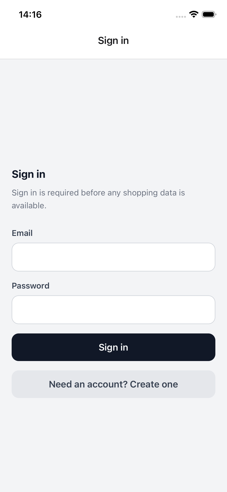

2. Ekran rejestracji

   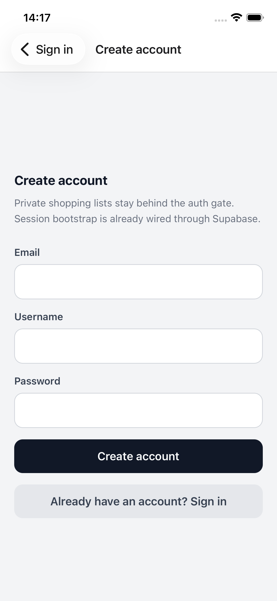

3. Główny ekran aplikacji z listą wszystkich list

   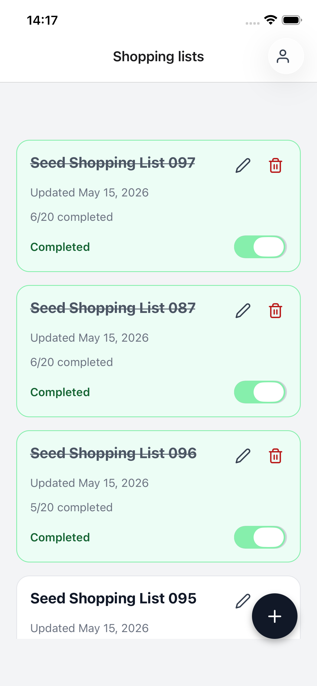

4. Dialog edycji listy

   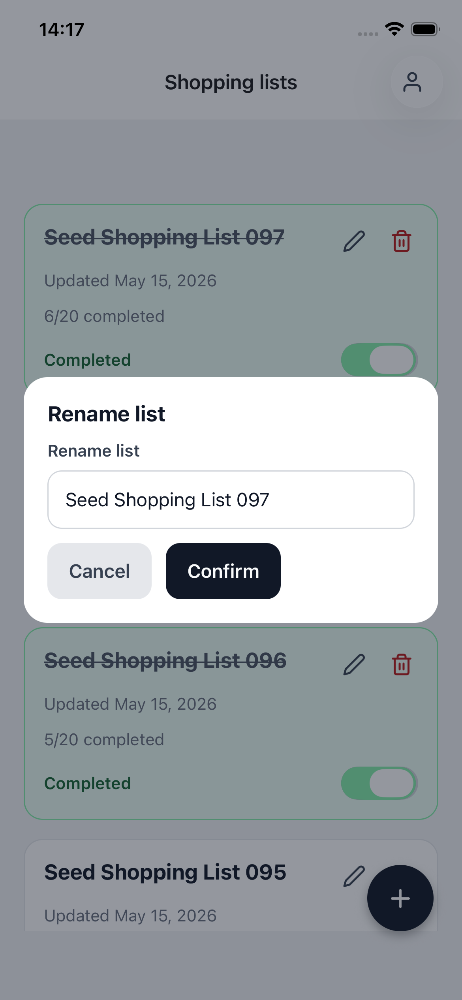

5. Dialog usuwania listy

   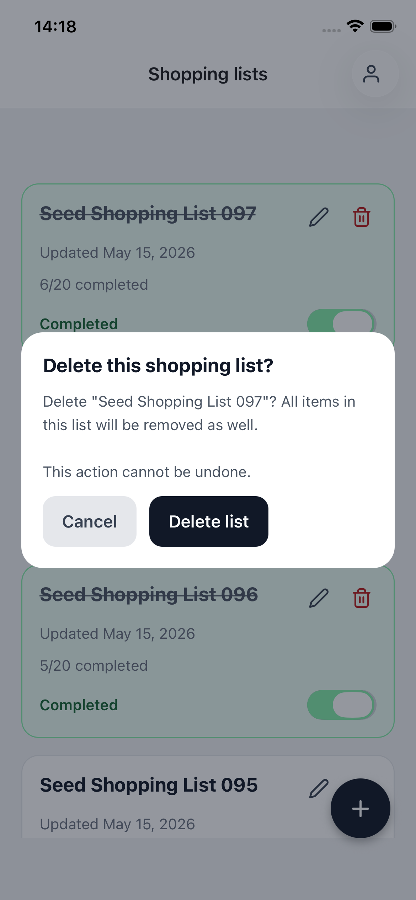

6. Dialog dodawania listy

   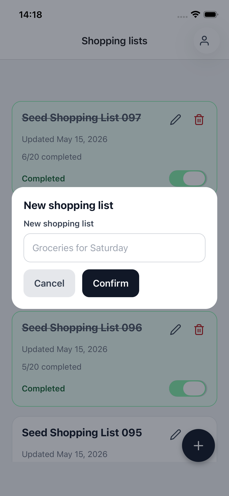

7. Ekran szczegółowy listy

   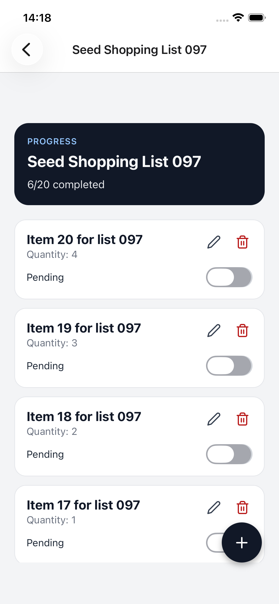

8. Dialog dodawania elementu listy

   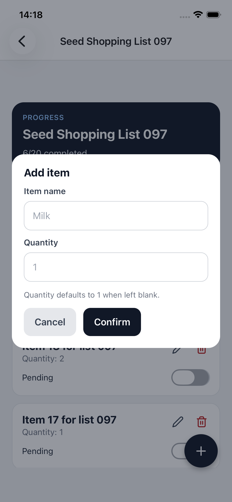

9. Dialog edycji elementu listy

   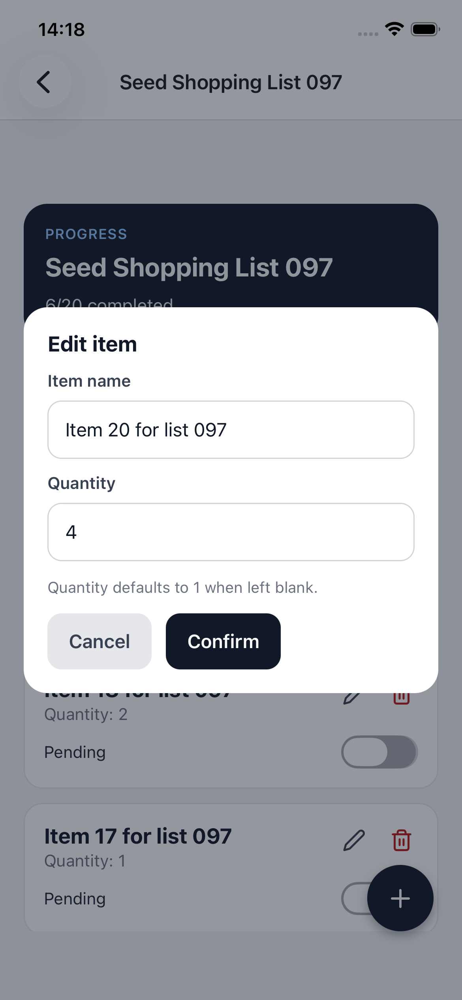

10. Dialog usuwania elementu listy

    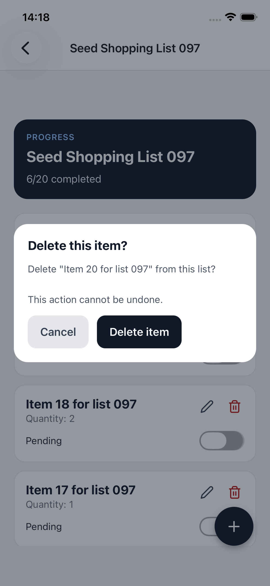

11. Ekran szczegółów konta użytkownika

    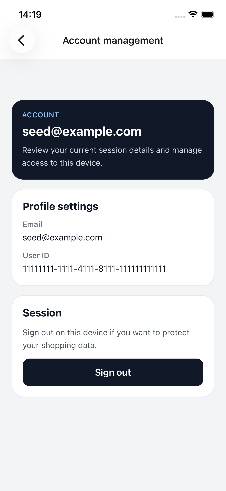

### 10.4 Elementy kodu warte uwagi

| Obszar                       | Pliki                                                                                                 |
| ---------------------------- | ----------------------------------------------------------------------------------------------------- |
| Start aplikacji i providerzy | `src/app/App.tsx`, `src/app/providers/SessionProvider.tsx`, `src/app/providers/QueryProvider.tsx`     |
| Nawigacja i ochrona widokow  | `src/app/navigation/AppNavigation.tsx`                                                                |
| Uwierzytelnianie             | `src/features/auth/screens/*`, `src/features/auth/api.ts`, `src/features/auth/validation.ts`          |
| Listy zakupow                | `src/features/shoppingLists/screens/ShoppingListsHomeScreen.tsx`, `src/features/shoppingLists/api.ts` |
| Produkty                     | `src/features/items/screens/ShoppingListDetailScreen.tsx`, `src/features/items/api.ts`                |
| Komponenty wspolne           | `src/components/*`                                                                                    |
| Lokalizacja                  | `src/localization/i18n.ts`, `src/localization/resources/en.ts`, `src/localization/resources/pl.ts`    |
| Baza danych i bezpieczenstwo | `supabase/migrations/*`, `src/types/database.ts`                                                      |

## 11. Podsumowanie

Projekt `Shopping List App` realizuje glowny cel aplikacji do prowadzenia prywatnych list zakupow w wersji edukacyjnej, ale jednoczesnie technicznie spojnej. Zawiera komplet kluczowych funkcji uzytkowych, bezpieczny model dostepu do danych, dwujezyczny interfejs, testy oraz czytelna organizacje kodu.
